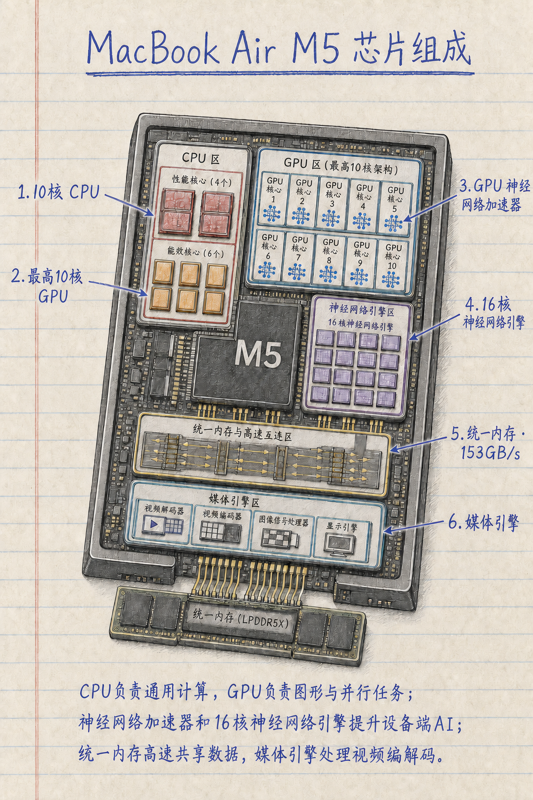

# Engineering Handdrawn Infographic Skill

一个可直接安装到 Codex 的通用 Skill，用于生成竖版手绘工程科普信息图。

它把设备结构、中文标注、箭头关系和工程课堂笔记视觉封装成一套可重复调用的工作流，适合机械、电子、芯片、能源、医疗器械等设备的组成部分与工作原理说明。

## 能做什么

- 生成暖白色横线笔记本纸、淡红页边线、蓝色圆珠笔手写标题和标签。
- 将设备绘制成局部打开、剖视或轻度爆炸拆解的工程插画。
- 自动补全 5–7 个核心部件、编号、蓝色直线箭头和 2–3 行原理说明。
- 优先检查真实工程装配关系、标签箭头对应关系和中文文字可读性。
- 实际成图时调用 Codex 内置 `image_gen`；用户明确要求提示词时只输出 prompt。

这是一张解释性科普信息图，不是制造图、维修手册、接线图或安全操作规程。对于陌生、型号专属或安全相关设备，应先提供资料或核对权威来源。

## 目录结构

```text
.
├── README.md
├── examples/
│   ├── assets/
│   │   └── apple-m5-chip-infographic.png
│   ├── apple-m5-chip.md
│   └── three-phase-induction-motor.md
└── skills/
    └── engineering-handdrawn-infographic/
        ├── SKILL.md
        ├── agents/openai.yaml
        └── references/prompt-template.md
```

## 安装到 Codex

将 `skills/engineering-handdrawn-infographic/` 整个目录复制到本机的 Codex skills 目录：

```bash
cp -R skills/engineering-handdrawn-infographic ~/.codex/skills/
```

如果使用自定义 `CODEX_HOME`，复制到对应的 `$CODEX_HOME/skills/`。完成后重新打开 Codex 任务或重启应用，让 Skill 索引刷新。

## 调用方式

### 直接生成图片

```text
使用 $engineering-handdrawn-infographic 生成一张离心泵组成部分的竖版手绘工程科普信息图。
```

只给出设备名称时，Skill 默认补全：

- 标题：“[设备名称]的组成部分”；
- 6 个最具辨识度的核心部件；
- 2–3 行面向普通读者的原理说明。

### 只生成提示词

```text
使用 $engineering-handdrawn-infographic，只给我提示词，不要生成图片：做一张三相异步电动机组成部分图。
```

### 指定完整参数

```text
使用 $engineering-handdrawn-infographic 生成：
- 主题：家用空气净化器的组成部分
- 中央设备：局部剖视的空气净化器
- 标签：风机、初效滤网、HEPA滤网、活性炭滤网、传感器、控制板
- 原理说明：写 3 行，解释空气流向和颗粒物过滤过程
```

## 图像生成规则

Skill 会把用户需求整理为结构化提示词，然后按以下顺序工作：

1. 提取主题、设备、部件清单和原理说明。
2. 检查部件是否属于该设备，避免把猜测当成型号事实。
3. 生成完整的纸张、主体、标签、箭头、底部说明和负面约束。
4. 调用内置 `image_gen` 生成位图。
5. 检查标题、标签、编号、箭头端点、工程结构、留白和负面元素。
6. 若发现一个明确问题，只做一次单点定向修正，避免破坏其他内容。

中文文字由图像模型直接绘制，仍可能出现错字或字形漂移。Skill 要求检查并诚实报告错误；如果文字必须出版级准确，可以先生成图像底稿，再使用后期排版工具重新叠加文字。

## 手动使用模板

不使用 Codex 时，可以直接打开 [`prompt-template.md`](skills/engineering-handdrawn-infographic/references/prompt-template.md)，替换方括号中的变量后交给支持图像生成的模型。标签数量必须与标签清单一致，不能留下未替换的占位符。

## 已验证示例

- [`examples/apple-m5-chip.md`](examples/apple-m5-chip.md)：芯片功能模块示意，包含 CPU、GPU、神经网络加速器、神经网络引擎、统一内存和媒体引擎。
- [`examples/three-phase-induction-motor.md`](examples/three-phase-induction-motor.md)：机械剖视示意，包含定子、三相绕组、鼠笼式转子、转轴和轴承等工程关系。

### Apple M5 芯片示例预览



这张图是本 Skill 实际生成并经过两次定向校正的示例：修正了 CPU 的 4 个性能核心 + 6 个能效核心数量，并将“GPU 神经网络加速器”箭头指向 GPU 核心内的加速器符号。

## 许可与贡献

本项目使用 [MIT License](LICENSE)。你可以复制、修改、集成和再分发 Skill 文本、提示词模板和示例，但请保留许可证声明。仓库不包含 Apple、其他厂商或第三方素材；使用产品名称、商标、产品资料和生成图片时，仍需遵守相应权利人的规则。

欢迎通过 Issue 或 Pull Request 提交：

- 新的设备示例；
- 更准确的工程结构约束；
- 标签避碰和中文文字质量改进；
- 不改变核心视觉体系的领域扩展。
